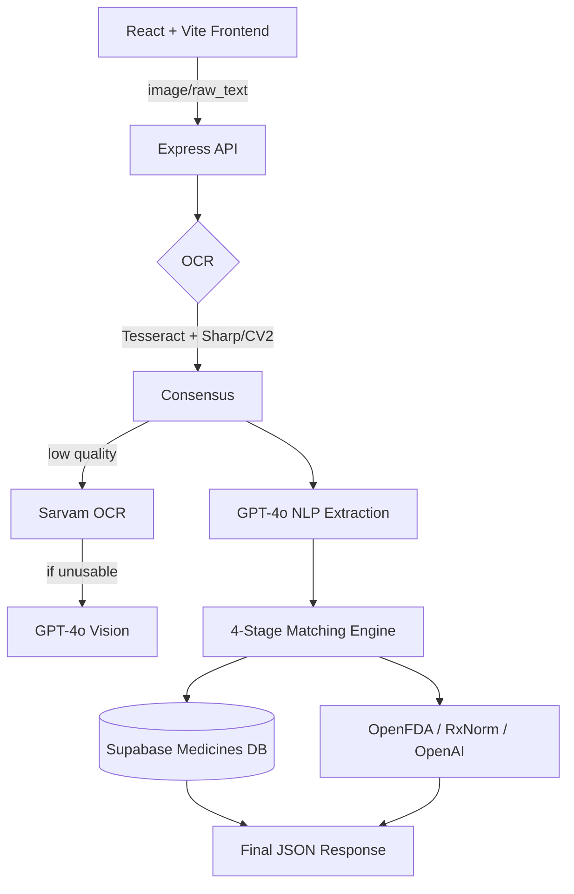

# MedMap AI

MedMap AI is a full-stack prescription parsing system.
It accepts prescription images or raw text, extracts structured medicine entities, matches them against an internal medicine database, and falls back to external verification when needed.

## Current Implementation

### OCR Pipeline (Image Input)
1. Multi-pass Tesseract OCR with Sharp preprocessing variants.
2. Optional CV2 preprocessing passes (`clahe`, `adaptive`) when Python OpenCV is available.
3. If Tesseract quality is low, fallback order is:
`Sarvam Document Intelligence` -> `OpenAI GPT-4o Vision`.
4. Refusal-like OCR text is detected and treated as unusable fallback output.

### NLP Extraction
- OpenAI GPT-4o JSON extraction for:
`medicines[]` + `medical_condition`.
- Empty/invalid text safely returns:
`{ medicines: [], medical_condition: null }`.

### Medicine Matching
- Stage 1: Exact match.
- Stage 2: Fuzzy (`pg_trgm`).
- Stage 3: Vector similarity (`pgvector` embeddings).
- Stage 4: External fallback (`OpenFDA`, `RxNorm`, then OpenAI knowledge).
- Result enrichment includes one-line medicine usage descriptions.

### API
- `GET /health`
- `POST /api/process-prescription`
- `POST /api/test-batch-images` (dev-only batch OCR test endpoint)

### Frontend
- React + Vite UI with responsive layout and pipeline/result visualization.

## Architecture



## Tech Stack

| Layer | Technology |
|---|---|
| Frontend | React 19, Vite |
| Backend | Node.js, Express (ESM) |
| OCR | Tesseract.js, Sharp, optional OpenCV (Python), Sarvam OCR, GPT-4o Vision |
| NLP | OpenAI GPT-4o |
| Database | Supabase (PostgreSQL, `pgvector`, `pg_trgm`) |

## Requirements To Run Website

### Mandatory
- OS: macOS/Linux/WSL (Windows via WSL recommended)
- Node.js (LTS or newer; tested on Node 25)
- npm (comes with Node)
- Supabase project with required schema/functions
- `OPENAI_API_KEY` (NLP + vision fallback)
- `SUPABASE_URL` and `SUPABASE_SERVICE_KEY`
- Internet access (OpenAI + external fallback services)

### Strongly Recommended
- `SARVAM_API_KEY` for primary OCR fallback on hard handwritten images

### Optional (for better OCR preprocessing)
- Python 3
- `venv` and `pip`
- OpenCV + NumPy (`requirements.txt`, see Python section)

### Required Local Ports
- `3001` for backend API
- `5173` (or next free Vite port like `5174`) for frontend

## Setup

### 1) Install Dependencies
```bash
git clone <repo-url>
cd medmap-ai

cd backend && npm install
cd ../frontend && npm install
```

### 2) Configure Environment
Create `backend/.env` and set at least:

```env
PORT=3001
FRONTEND_URL=http://localhost:5173

OPENAI_API_KEY=...
SUPABASE_URL=...
SUPABASE_SERVICE_KEY=...

# Recommended for primary OCR fallback
SARVAM_API_KEY=...
```

Optional OCR tuning keys used by current code:

```env
OCR_MIN_CONSENSUS_PASSES=3
OCR_MIN_CONFIDENCE_SCORE=40

OCR_ENABLE_CV2=true
CV2_PYTHON_BIN=python3
CV2_PROCESS_TIMEOUT_MS=8000
CV2_CHECK_TIMEOUT_MS=10000

SARVAM_OCR_TIMEOUT_MS=35000
SARVAM_OCR_POLL_MS=1200
SARVAM_OCR_MAX_ATTEMPTS=2
SARVAM_OCR_TIMEOUT_BACKOFF_MS=10000
SARVAM_OCR_START_RETRIES=5
SARVAM_OCR_START_RETRY_DELAY_MS=1200
SARVAM_OCR_RETRY_DELAY_MS=1500
```

### 3) Optional CV2 Setup (Recommended)
```bash
python3 -m venv backend/.venv-ocr
backend/.venv-ocr/bin/python -m pip install -r requirements.txt
```

Then point backend to that interpreter:

```env
CV2_PYTHON_BIN=/absolute/path/to/medmap-ai/backend/.venv-ocr/bin/python
```

### 4) Database Initialization
Run SQL files in Supabase SQL editor:
1. `database/01_extensions.sql`
2. `database/04_functions.sql`

Then import data and generate embeddings:

```bash
cd backend
npm run import
npm run embeddings
```

## Run Locally

Terminal 1:
```bash
cd backend
npm run dev
```

Terminal 2:
```bash
cd frontend
npm run dev
```

Notes:
- Backend runs on `http://localhost:3001`.
- Frontend usually runs on `http://localhost:5173` (or next free port like `5174`).

## Batch OCR Test (Dev)

Use this endpoint to test local image series such as `MED-1.jpg` ... `MED-10.jpg`.

```bash
curl -X POST http://localhost:3001/api/test-batch-images \
  -H "Content-Type: application/json" \
  -d '{
    "directory": "/Users/you/Downloads",
    "prefix": "MED-",
    "start": 1,
    "end": 10,
    "extension": "jpg",
    "options": { "ocr_passes": 7, "min_consensus": 3 }
  }'
```

## License

MIT
